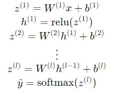
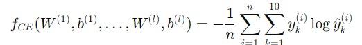

# Back Propogation of Multi-layer Neural Network

In this assignment, we develop a multi-layer feed-forward neural network to classify images of fashion items from the Fashion MNIST dataset, which consists of 10 different classes. The network will process 28x28 pixel images, converting them into 784-dimensional vectors, and output a probability distribution over the classes. A key focus of this assignment is implementing the backpropagation algorithm from scratch to efficiently compute gradients for training.

The architecture of the neural network will follow these equations:

  

Our task is to minimize the unregularized cross-entropy cost function defined as:

  

