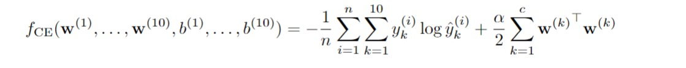

# Implementation of softmax regression

In this assignment, you'll train a 2-layer softmax neural network to classify images of fashion items from the Fashion MNIST dataset. The network will take 28x28 pixel images, which will be flattened into 784-dimensional vectors, and output a vector of 10 probabilities corresponding to different fashion categories (such as shoes, t-shirts, and dresses).

The objective is to minimize the cross-entropy loss function, defined as:

​
where, 
𝑛 is the number of examples, 𝑦(𝑖) represents the true labels, 𝑦^(𝑖) the predicted probabilities, and α a regularization constant. It's important to regularize the weights while leaving the biases unregularized.

Key Steps:
Dataset Preparation: Download the Fashion MNIST dataset from the provided links. The labels are in a 1-dimensional array, while the images are stored as a 2-dimensional array of size 
𝑛
×
784
n×784.

Normalization: Normalize the pixel values by dividing each by 255 to enhance training efficiency.

Stochastic Gradient Descent (SGD): Implement SGD to minimize the cross-entropy loss function. Use the same hyperparameters as in the previous assignment, including splitting the training data into training and validation sets.

Performance Evaluation: After tuning the hyperparameters, evaluate the model on the test set. Report both the unregularized cross-entropy loss and the percentage of correctly classified examples in your final submission.
